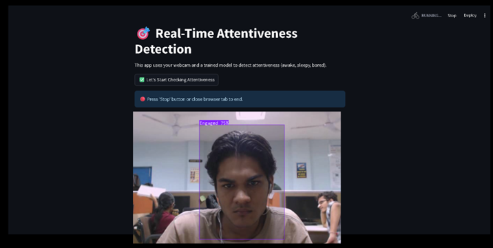
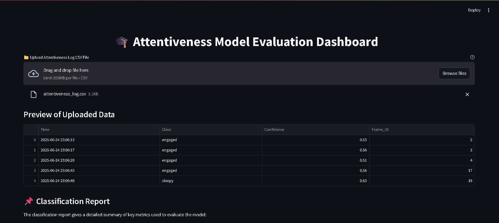

# Attentiveness Tracker 🎯

A real-time computer vision project that detects and tracks student attentiveness levels—such as **Engaged**, **Bored**, or **Sleepy**—using webcam footage. Built using Python, Roboflow, Streamlit, OpenCV, and deep learning techniques.

## 🔍 Features

- Detects 3 levels of attentiveness: Engaged, Bored, and Sleepy.
- Real-time classification with confidence score.
- Clean UI built using Streamlit.
- Alerts via sound for drowsy/inattentive behavior.
- CSV logging of timestamps and attentiveness states.
- Visual analytics using Matplotlib and Seaborn.

## ⚙️ Tech Stack

- **Frontend**: Streamlit (Python)
- **Backend**: Python
- **Computer Vision**: OpenCV, Roboflow API
- **Model**: Trained via Roboflow (YOLOv12)
- **Libraries**: NumPy, Pandas, Seaborn, Matplotlib, TensorFlow/Keras
- **Deployment**: Local (or can be deployed to cloud)

## 📂 Dataset

- Used **Roboflow** for annotation and model training.
- Dataset link: [Attention50K (Roboflow)](https://app.roboflow.com/attentiveness50k/attention50k/2)
- Based on samples from **DAiSEE dataset** and custom-labeled data.

## 🚀 Installation & Setup

### 1. Clone the Repository
```bash
git clone https://github.com/your-username/attentiveness-tracker.git
cd attentiveness-tracker
```
### 2. Create Virtual Environment
```bash
python -m venv venv
venv\Scripts\activate  # For Windows
# OR
source venv/bin/activate  # For macOS/Linux
```
### 3. Install Required Libraries
```bash
pip install -r requirements.txt
```
### 4. Run the Streamlit App
```bash
streamlit run streamlit_app.py
```

## 🧠 Model Inference Flow
- Capture webcam input using OpenCV.

- Send frame to Roboflow API for model inference.

- Receive predicted label and confidence score.

- Display results live on the Streamlit dashboard.

- Log prediction into CSV and play alert if inattentive behavior is detected.
  

## 📁 Project Structure
```bash
├── alert.mp3                          # Alert audio (for sleepy detection)
├── detect_webcam.py                  # Webcam capture and live detection logic
├── streamlit_app.py                  # Main UI logic using Streamlit
├── attentiveness_log.csv             # CSV file to log attentiveness states
├── plot_attentiveness_confidence.py # Plotting script for confidence analytics
├── evaluate_model.py                 # Script to evaluate and test model accuracy
├── attentiveness_csv_cleaner.py     # CSV cleaner script for logs
├── requirements.txt                  # All Python dependencies
├── README.md                         # Project documentation (you are here)
```
## 📸 Screenshots
Here's a look at the Attentiveness-Tracker in action:

### Real-Time Detection



### Model Evaluation Dashboard



## 🔧 Future Enhancements
- ✅ Add face recognition to identify individual students.

- ✅ Add confidence graphs to show attentiveness trend.

- ✅ Deploy to web using Render, HuggingFace Spaces, or Streamlit Cloud.

- ✅ Integrate with school LMS or attendance systems.

- ✅ Export detailed student engagement reports.

## 🧾 License
 - This project is licensed under the MIT License.
